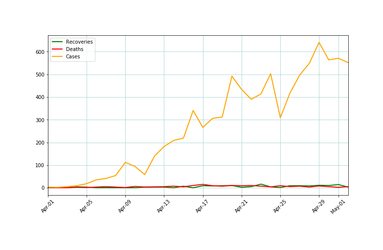
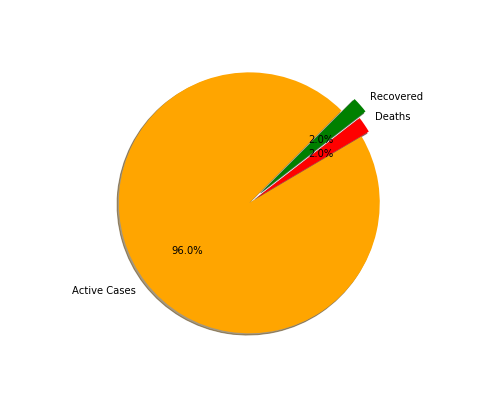
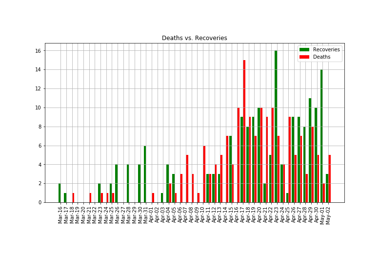
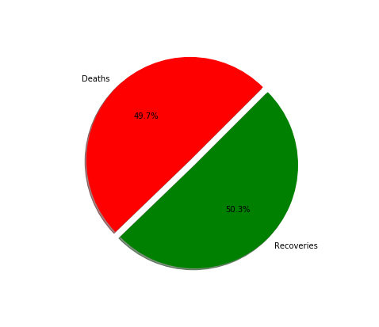

# Covid
Covid-19 Analysis Bangladesh
  
>***Abstract:*** This Dataset is updated every 24 hours based on Bangladesh IEDCR (Institute of Epidemiology, Disease Control and Research) information.
>Daily new deaths, new cases and new recoveries are collected from IEDCR.

>The pupose of this analysis is to find out how the rates of infection are changing in Bangladesh and whether the deaths and recoveries ratio is alarming for the future or not? 

>In this chart it can be seen that the number of patients infected with ***Covid-19*** is sharply increasing; however, the number of deaths and recoveries are increasing gradually.
> 

>Majority of the people infected with ***Covid-19*** is still Active. This is an alarming sign because they have the potential to either recover or die from the virus. 
> 

>Date wise ***Deaths vs. Recoveries*** 
>

>***Recoveries*** percentage should be greater than ***Death*** rates but here we can clearly see that it is not, which is predicting an horrible future for Bangladesh 
> 

>***Conclusion:*** The findings clearly show the alarming situation of Bangladesh and how it may exacerbate in the near future. Inital steps must be taken early enough in attempts to flatten the curve.  

